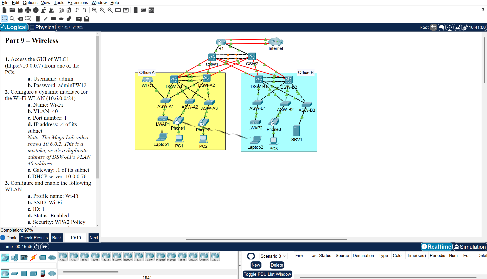

# JITL-Mega-Lab
This is a Cisco Packet Tracer lab based on Jeremy's IT Lab CCNA Course - Mega Lab. The link to the video can be found [here](https://youtu.be/2p7-MluKAgE). This lab is very beneficial for those who plan to take the CCNA. It covers all the topics in which the configuration is tested in the CCNA and even those that are not tested (e.g. SNMP, FTP).
 
 
## Description
The lab is based on a 3 layer LAN architecture which consists of a single router, switches - core, distribution and access, WLC, APs, End hosts, and a Server. The configurations that I uploaded are correct but not exactly the same thus getting the 97% on the lab.
For example, 
Mine, 
`ASW1(config)#switchport access vlan 10` 
`ASW1(config)#switchport access vlan 20` 
`ASW1(config)#switchport access vlan 30` 
JITL, 
`ASW1(config)#switchport access vlan 10,20,30`
## Topics Covered
- Password, Username
- VLANs
- Layer 2/3 EtherChannel
- IPv4, Ipv6 Addressing
- Static & Dynamic Routing
- HSRP
- RSTP
- DHCP
- DNS
- NTP
- SNMP
- Syslog
- FTP
- SSH
- NAT
- Normal & Extended ACLs
- Port-Security
- DHCP Snooping
- DAI
- WLC Configuration (Dynamic Interfaces & WLAN)

## Image

